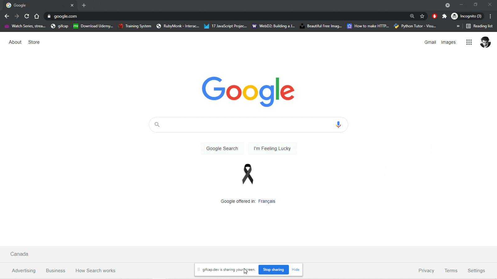

# MiTienda

MiTienda is an example of an e-commerce app that allows users to select from the available options, add them to their cart, and process the purchase via Stripe. The app was built using React, Material-UI, Bootstrap, and with the animations coming from LottieFiles.

## Available Scripts

To duplicate this project feel free to Git Clone it and then `npm install` the dependencies. 

## Final Product

